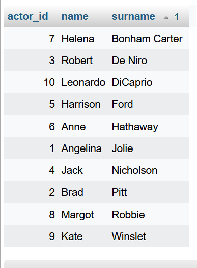

Task 1: Testy eksploracyjne
======
* * *

Subtask 1
---------

 9 punktów

* * *

Subtask 3
---------

Zastanawiam się nad zmianą pracy i branży, a mieliśmy szkolenie w pracy powiązane z programowaniem i IT, co zawsze mnie ciekawiło, ale nigdy nie miałam okazji próbować. Chciałam przekonać się jak praktycznie wygląda testowanie, do tego lubię wyszukiwać szczegóły i błędy oraz nie boję się klikać :smiley:

* * *

Subtask 4
---------

### Aplikacja Scouts panel:

Gromadzi informacje na temat zawoników piłki nożnej w celu wyselekcjonowania najlepszych graczy, dlatego najważniejszym jest aby te informacje były łatwo dostępne i przejrzyście uporządkowane.

### Funkcjonalności aplikacji:

*   możliwe jest zalogowanie/wylogowanie

*   dla każdego gracza możliwe jest dopisanie rozegranego meczu i jego dokładnych statystyk

*   z dostępnych meczy możliwe jest wygenerowanie raportów, które można uzupełnić o opis

*   tworzenie nowych profili graczy/uzupełnienie bazy graczy
*   przeglądanie bazy graczy, także sortowanie i wyszukiwanie graczy
    
*   dla każdego gracza możliwe jest dopisanie rozegranego meczu i jego dokładnych statystyk
    
*   z dostępnych meczy możliwe jest wygenerowanie raportów, które można uzupełnić o opis
    

### Intuicyjność dostępnych funkcjonalności:

#### Nie wszystkie z dostępnych funkcjonalności są intuicyjne np.:

*   Na podstronie „Gracze”,gdzie jest lista piłkarzy w bazie nie ma przycisku umożliwiającego dodanie nowego gracza – trzeba wrócić na stronę główną i znaleźć odnośnik w linkach pomocniczych. Nieporozumienie może także powodować przycisk „Dodaj raport” na podstronie z wygenerowanymi raportami, ponieważ przenosi on bez wyjaśnienia do zakładki „mecze” nie informując, co właściwie należy dalej zrobić, żeby otrzymać raport.
    
*   Na stronie wyświetlanych jest jedynie 10 graczy, nie ma możliwości zmiany liczby wyświetlanych wyników, ani przejścia na koniec listy.
    
*   Brak wskazówki pod względem jakiego kryterium jest wyświetlana lista meczów zawodnika – podpowiedzią mogłaby być data dodania lub opcja sortowania pod względem klikniętego nagłówka. Po dodaniu meczu pokazuje się on na końcu listy wszystkich meczów, co jest nieintuicyjne oraz przy dużej liczbie pozycji niewygodne.
    
*   Niewykorzystaną informacją jest minuta meczu zaznaczanej akcji w zakładce „Rozpocznij mecz” – powinno to być ujęte w raporcie.
    
*   Dodawanie zdarzeń do meczu w zakładce „Rozegraj mecz” jest zupełnie nieintuicyjne, ponieważ po na jechaniu na ikonki nie wyświetla się jej funkcja, po dodaniu akcji nie można już tego znacznika usnąć ani edytować oraz nie wiadomo, który znacznik był jakim zdarzeniem, ponieważ nie wyświetlają się o nim żadne informacje (ani w oknie po najechaniu na niego, ani w formie listy poniżej).
    
*   Niektóre informacje wprowadzane w profilu gracza oraz meczu powinny być rozwijaną listą np. pozycja piłkarza. W „dodawaniu meczu” powinna być jeszcze rubryka na jakiej pozycji grał piłkarz w tym konkretnym meczu, ponieważ w profilu gracza możliwe jest wpisanie pozycji głównej i alternatywnej, a wyświetlane opcje w danym meczu w „rozpocznij mecz” są domyślnie ustawione dla pozycji głównej, co najczęściej będzie się zgadzało, ale nie zawsze.
    
*   Po każdej zmianie w zestawieniu meczu oraz w rozgrywce trzeba generować nowy raport, nie aktualizuje się już istniejący, prowadzi to do dublowania i mnożenia liczby aktualnych i nieaktualnych raportów, których dodatkowo nie można usunąć.
    

Dodałabym podsumowanie (nieedytowalne) na profilu piłkarza, a edycję jako kolejny krok do przejścia z profilu.

Brakuje możliwości porównywania graczy, a także podsumowania statystyk gracza po wejściu w jego profil (niepełne dostępne są tylko w widoku całej listy graczy).

### Wygląd:

*   Plusem jest stonowana kolorystyka i przejrzystość (brak wielu chaotycznych elementów), jednak całość sprawia wrażenie wersji roboczej i niedokończonej.
    
*   Boczne menu jest nieintuicyjne, nie odzwierciedla relacji i hierarchii elementów listy.
    
*   Strona główna jest niepraktyczna, informacje i odnośniki wydają się niewystarczające, strona główna funkcjonuje właściwie jedynie w celu skorzystania z opcji „dodaj gracza” oznaczonej jako linki pomocnicze, gdzie nie jest jej miejsce, ponieważ dodawanie graczy jest jedną z głównych funkcji tego panelu. Brak tu też okna wyszukiwania.
    
*   Przy obsłudze klawiszami podświetlenia są nieczytelne i pojawiają się po dwa razy: 

### Błędy:

*   Bardzo niska wydajność – długi czas wstępny reakcji serwera. Przy wolniejszym połączeniu internetowym bardzo długo ładuje się każda podstrona, gdzie jest dużo informacji, np. „Gracze”.
*   Przy obsłudze klawiszami w niektórych przypadkach nie można wejść w zawartość naciskając enter.
    
*   W opcji „Przypomnij hasło” nie ma informacji o błędzie, jeśli wpisze się coś innego niż mail.
    
*   Przy wyszukiwaniu piłkarza w oknie „Szukaj” opcja ta nie działa, jeśli wpisuje się imię i nazwisko, działa jedynie przy wpisaniu tylko albo imienia albo nazwiska.
    
*   W edycji gracza: można dodać wagę i wzrost ujemne, przy wadze brak określonej jednostki, brak ograniczeń dla znaków wpisywanych w telefon (dopuszczalne litery i za długie/ za krótkie ciągi cyfr), możliwe jest dodanie przyszłej daty urodzenia, brak kontroli co jest wpisywane w rubryce z linkami. Dodatkowo linki nie wyświetlają się jako hiperłącza, tylko jako zwykły tekst, który trzeba skopiować, żeby w niego wejść. Gdy niepoprawnie wpisze się adres e-mail niemożliwe jest zapisanie profilu, jednak nie ma informacji, w której rubryce jest błąd.
    
*   W „dodanie meczu”: możliwe jest wpisanie daty w przyszłości, możliwe jest dodawanie ujemnych liczb w czasie oraz numerze koszulki, nie ma kontroli wklejanego tekstu w rubryce „Web match”.
    
*   W „Raportach”: przy tworzeniu id meczu i gracza nie działa przycisk „clear”, opcja „cytat” w edycji tekstu w raporcie daje tylko wcięcie tekstu. Nie działa przycisk „wróć do raportu” w przypadku wyjścia i nie zapisania tworzonego raportu.
    
*   W „Rozpocznij mecz”: za późno o 1 sekundę pauzuje się zegar, dodawanie zdarzeń możliwe tylko jak jest uruchomiony zegar (dodawanie akcji nie pauzuje go), można dodać ujemny czas, ale może to być przydatne przy dogrywce, można za to ustawić więcej niż dwie połowy.
    
*   Nie wyświetla się favicon (błąd 404).
* * *

Task 2: Test cases
======
* * *

Subtask 1
---------
[Przypadki testowe na podstawie User Story](https://docs.google.com/spreadsheets/d/1-wAf31E76_X2PXHe6B3eY2_9sM2ecmgVdi_MraQ5gE0/edit?usp=sharing)

* * *
Subtask 2
---------
[Przypadki testowe na podstawie “własnych doświadczeń"](https://docs.google.com/document/d/1jdNBoIOo_dSgxcfpOr7DRsupr08_Wt4CAozyikA97YI/edit?usp=sharing)

* * *
Subtask 3
---------
Po co piszemy test case’y?
* Test case przydatne są do uporządkowania pracy, szybkiego odnalezienia na jakim etapie testowania się jest oraz nie pogubienia się w tym gąszczu
* Mogą się także przydać, gdy nasz projekt dostanie ktoś po nas - będzie mógł łatwo i szybko odtworzyć testy
* Szybko będzie można przeprowadzić jeszcze raz test np. po wprowadzonych zmianach lub naprawionych usterkach

* * *
Task 3: Raportowanie błędów
======
* * *

Subtask 2
---------
[Bugs Reports](https://docs.google.com/spreadsheets/d/1IO59aS6apXWVpZZQe_7vELbjcHcz2QyeJE5OVG-UOKk/edit?usp=sharing)
* * *

Subtask 3
---------
[Tests Report](https://docs.google.com/spreadsheets/d/1KTuDIrWS6Ofl8UZmbfxIeZBIdSVywJvJE-yDex69ee8/edit?usp=sharing)

* * *
Task 4: Testowanie aplikacji mobilnych
======
* * *

Subtask 2
---------
[Bugs Report Olx](https://docs.google.com/spreadsheets/d/1P-H6yRZdTrsD066bxMJL8cB-ZfiorCecuvcOQUmmLeE/edit?usp=share_link)
* * *
Subtask 3 
---------
1. *Do czego służy ta aplikacja?*

    Aplikacja służy do **sprzedaży, kupna, wymiany lub oddania za darmo usług i przedmiotów**. Umożliwia także dodanie **oferty pracy, aplikowanie o pracę** w odpowiedzi na ogłoszenie oraz stworzenie swojego profilu kandydata. Głównym celem jest szybkie wyszukiwanie oraz zakup lub dodawanie i sprzedaż potrzebnych rzeczy/usług głównie przez osoby prywatne. Platforma umożliwia i ułatwia poszukiwanie oraz **kontakt pomiędzy kupującym a sprzedającym**.

2. *Kto ma być użytkownikiem końcowym aplikacji?*
   
   
   Głównie są to osoby prywatne, oferujące sprzedaż lub kupno przedmiotów/usług.

3. *Czy według Ciebie aplikacja jest user friendly?*
   
   
   Aplikacja **jest user-friendly** - jest czytelna, posiada w odpowiednim (intuicynym) miejscu skróty do najważniejszych opcji, łatwo można nauczyć się jej obsługi, wszystkie potrzebne informacje są widoczne, ale jednocześnie nie jest nimi przeładowana, posiada stonowane kolory i przejrzysty układ, szybko się ładuje. Dodatkowo posiada ułatwienia i funkcje, kótre nie są niejasne - wiadomo, co ich wybranie spowoduje.
    
5. *Jak byś usprawnił aplikację?*
    
    
    Lepsze dopasowanie "Ofert wybranych dla ciebie" oraz możliwośc porównywania wybranych ofert.

6. *Jakie dostrzegasz różnice pomiędzy testowaniem aplikacji internetowej, a natywnej?*

*  Główną różnicą jest konieczność **zainstalowania** aplikacji natywnej, więc przez to też **posiadania odpowiednich urządzeń testowych** lub wykorzystania emulatora urządzeń. 
*  Przy aplikacjach natywnych dużo **większe znaczenie ma urządenie**, na których zostają one zainstalowane i przeprowadzone testy. 
*  W testowaniu aplikacji natywnej nie mamy dostępu do **Devtools**.

* * *
Task 5: SQL 1
======
* * *

Subtask 1
---------
* SELECT
* SELECT DISTINCT
* WHERE (and, or, not)
* IS NULL, IS NOT NULL
* ORDER BY
* GROUP BY
* INSERT INTO
* DELETE
* MIN, MAX
* LIKE
* IN
* BETWEEN
* ANY, ALL
* EXISTS

* * *

Subtask 1
---------
**1. Wyświetl tabelę actors w kolejności alfabetycznej sortując po kolumnie surname.**

SELECT * 
FROM actors 
ORDER BY surname;

**2. Wyświetl film, który powstał w 2019 roku.**

SELECT *
FROM movies 
WHERE year_of_production = 2019;

**3. Wyświetl wszystkie filmy, które powstały między 1900, a 1999 rokiem.**

SELECT * 
FROM movies 
WHERE year_of_production BETWEEN 1900 AND 1999;

**4. Wyświetl JEDYNIE tytuł i cenę filmów, które kosztują poniżej 7$.**

SELECT price, title 
FROM movies 
WHERE price < 7;

**5. Użyj operatora logicznego AND, aby wyświetlić aktorów o actor_id pomiędzy 4-7 (4 i 7 powinny się wyświetlać). NIE UŻYWAJ operatora BETWEEN.**

SELECT * 
FROM actors 
WHERE actor_id >= 4 AND actor_id <= 7;

**6. Wyświetl klientów o id 2,4,6 wykorzystaj do tego warunek logiczny.**

SELECT * 
FROM actors 
WHERE actor_id = 2 OR actor_id = 4 OR actor_id = 6;

**7. Wyświetl klientów o id 1,3,5 wykorzystaj do tego operator IN.**

SELECT * 
FROM actors 
WHERE actor_id IN (1, 3, 5);

**8. Wyświetl dane wszystkich osób z tabeli ‘actors’, których imię zaczyna się od ciągu “An”.**

SELECT * 
FROM actors 
WHERE NAME LIKE 'AN%';

**9. Wyświetl dane klienta, który nie ma podanego adresu email.**

SELECT * 
FROM customers 
WHERE email IS NULL; 

**10. Wyświetl wszystkie filmy, których cena wynosi powyżej 9$ oraz ich ID mieści się pomiędzy 2 i 8 movie_id.**

SELECT * 
FROM movies 
WHERE price > 9 AND movie_id BETWEEN 2 AND 8;

* * *
